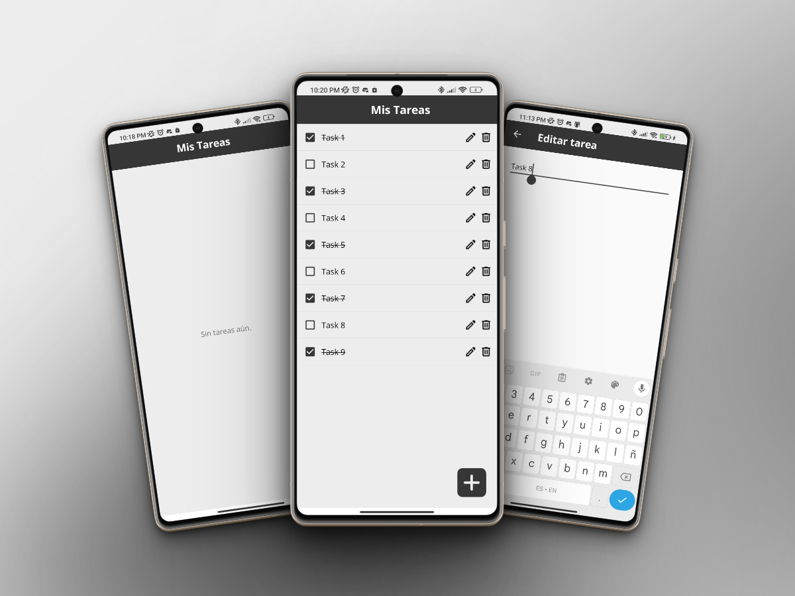
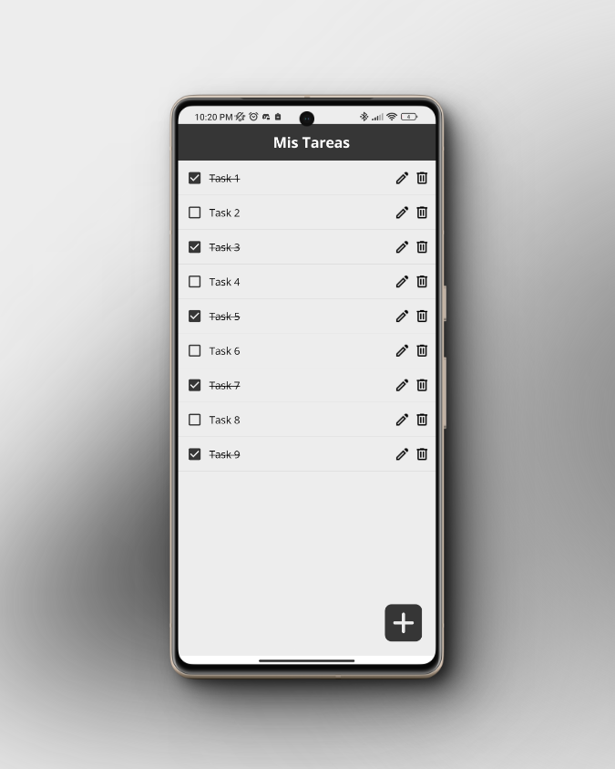
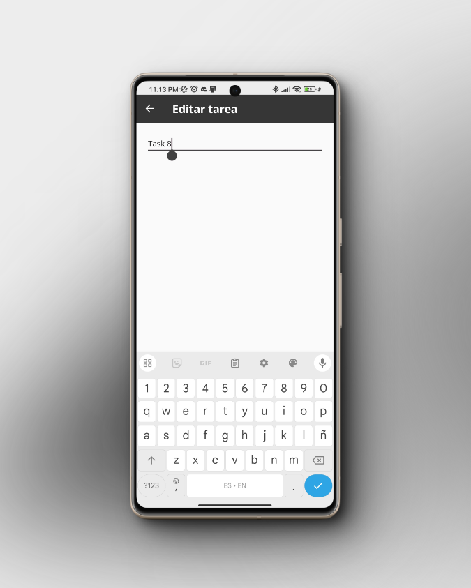

# Basic To-Do List App

## Descripción
Una aplicación básica de lista de tareas desarrollada en Xamarin Forms, aplicando el patrón de arquitectura MVVM (Model-View-ViewModel). Esta aplicación permite a los usuarios crear, editar y marcar tareas como completadas.

## Tecnologías Utilizadas
- **Xamarin.Forms**: Un framework para construir interfaces de usuario nativas en iOS, Android y Windows con una base de código compartida en C#.
- **SQLite**: Una base de datos SQL embebida que se utiliza para almacenar las tareas localmente en el dispositivo.

## Características
- Crear nuevas tareas.
- Editar tareas existentes.
- Marcar tareas como completadas.
- Persistencia de datos con SQLite.

## Cómo Empezar
Para ejecutar esta aplicación en tu entorno local, sigue estos pasos:
1. Clona el repositorio en tu máquina local.
2. Abre el archivo `ListaTareas.sln` con Visual Studio.
3. Restaura los paquetes NuGet necesarios.
4. Ejecuta la aplicación en un emulador o dispositivo.

## Contribuciones
Las contribuciones son bienvenidas. Si deseas contribuir al proyecto, por favor haz un fork del repositorio, crea una rama con tus mejoras y envía un pull request.

## Capturas de Pantalla

A continuación, se muestran algunas capturas de pantalla de la aplicación móvil:

### Pantalla de Inicio

### Pantalla de Agregar/Editar tarea

## Contacto

Para cualquier consulta o sugerencia, no dudes en contactarte conmigo:
- Jean Paul Vasquez - @Paul-06
---

© 2024 Paul-06/Basic To-Do List App. Todos los derechos reservados.
